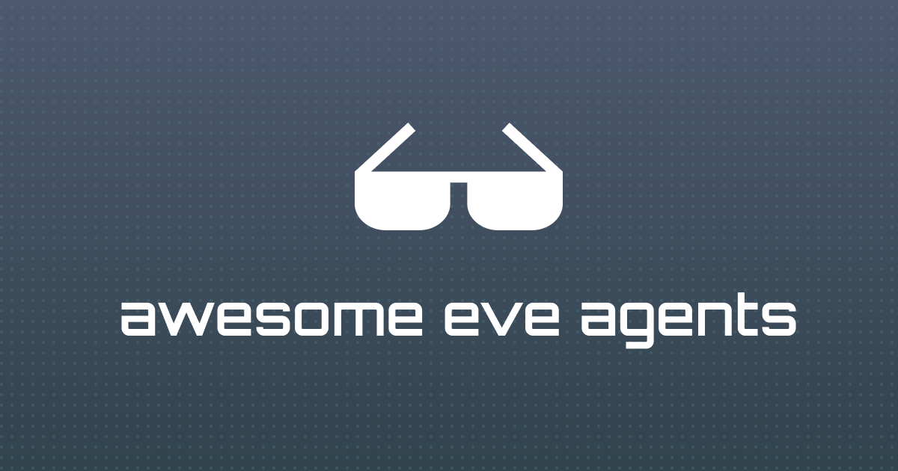

# Awesome Eve Agents [](https://awesome.re)



<br>

> A curated collection of 20 open-source agents for [Eve](https://vercel.com/eve), covering engineering, product, analytics, support, marketing, finance, research, and more. Explore every agent, its source files, and available integrations on [EveAgents](https://eveagents.dev).

**[Browse all Eve agents on EveAgents.dev](https://eveagents.dev)**

## Eve Agents

<table>
  <tr>
    <td width="33%" valign="top">
      <a href="https://eveagents.dev/engineering/incident-response-commander"><b>Incident Response Commander</b></a><br />
      <sub><b>Engineering</b></sub><br />
      <sub>Investigate incidents, coordinate responders, and turn evidence into a clear recovery plan.</sub>
    </td>
    <td width="33%" valign="top">
      <a href="https://eveagents.dev/engineering/bug-triage-coordinator"><b>Bug Triage Coordinator</b></a><br />
      <sub><b>Engineering</b></sub><br />
      <sub>Turn scattered bug reports and telemetry into prioritized, reproducible engineering work.</sub>
    </td>
    <td width="33%" valign="top">
      <a href="https://eveagents.dev/engineering/release-readiness-manager"><b>Release Readiness Manager</b></a><br />
      <sub><b>Engineering</b></sub><br />
      <sub>Assess release risk across open work, errors, adoption signals, documentation, and deployment state.</sub>
    </td>
  </tr>
  <tr>
    <td width="33%" valign="top">
      <a href="https://eveagents.dev/engineering/api-reliability-investigator"><b>API Reliability Investigator</b></a><br />
      <sub><b>Engineering</b></sub><br />
      <sub>Diagnose failing APIs by connecting requests, logs, traces, monitors, and application errors.</sub>
    </td>
    <td width="33%" valign="top">
      <a href="https://eveagents.dev/engineering/mcp-server-operations-manager"><b>MCP Server Operations Manager</b></a><br />
      <sub><b>Engineering</b></sub><br />
      <sub>Monitor MCP servers, investigate tool failures, and prepare safe operational remediations.</sub>
    </td>
    <td width="33%" valign="top">
      <a href="https://eveagents.dev/engineering/database-health-analyst"><b>Database Health Analyst</b></a><br />
      <sub><b>Engineering</b></sub><br />
      <sub>Investigate database performance, query behavior, capacity, and operational risk without making unsafe changes.</sub>
    </td>
  </tr>
  <tr>
    <td width="33%" valign="top">
      <a href="https://eveagents.dev/product/product-feedback-synthesizer"><b>Product Feedback Synthesizer</b></a><br />
      <sub><b>Product</b></sub><br />
      <sub>Turn qualitative feedback and product signals into evidence-backed themes and opportunities.</sub>
    </td>
    <td width="33%" valign="top">
      <a href="https://eveagents.dev/product/sprint-planning-facilitator"><b>Sprint Planning Facilitator</b></a><br />
      <sub><b>Product</b></sub><br />
      <sub>Build a realistic sprint proposal from priorities, capacity, dependencies, and delivery risk.</sub>
    </td>
    <td width="33%" valign="top">
      <a href="https://eveagents.dev/analytics/feature-adoption-analyst"><b>Feature Adoption Analyst</b></a><br />
      <sub><b>Analytics</b></sub><br />
      <sub>Explain feature adoption, drop-off, cohorts, and unexpected behavior without overstating causality.</sub>
    </td>
  </tr>
  <tr>
    <td width="33%" valign="top">
      <a href="https://eveagents.dev/knowledge/knowledge-base-curator"><b>Knowledge Base Curator</b></a><br />
      <sub><b>Knowledge</b></sub><br />
      <sub>Answer internal questions with sources and turn stale, conflicting knowledge into reviewable updates.</sub>
    </td>
    <td width="33%" valign="top">
      <a href="https://eveagents.dev/customer-support/customer-support-triage-agent"><b>Customer Support Triage Agent</b></a><br />
      <sub><b>Customer Support</b></sub><br />
      <sub>Classify support requests, find grounded answers, draft replies, and prepare clean escalations.</sub>
    </td>
    <td width="33%" valign="top">
      <a href="https://eveagents.dev/customer-success/customer-onboarding-concierge"><b>Customer Onboarding Concierge</b></a><br />
      <sub><b>Customer Success</b></sub><br />
      <sub>Guide customers through onboarding with contextual next steps, progress tracking, and timely follow-up.</sub>
    </td>
  </tr>
  <tr>
    <td width="33%" valign="top">
      <a href="https://eveagents.dev/marketing/content-publishing-manager"><b>Content Publishing Manager</b></a><br />
      <sub><b>Marketing</b></sub><br />
      <sub>Prepare, review, publish, and verify content and media across modern website platforms.</sub>
    </td>
    <td width="33%" valign="top">
      <a href="https://eveagents.dev/marketing/seo-growth-analyst"><b>SEO Growth Analyst</b></a><br />
      <sub><b>Marketing</b></sub><br />
      <sub>Find evidence-backed search opportunities and turn them into prioritized content and site recommendations.</sub>
    </td>
    <td width="33%" valign="top">
      <a href="https://eveagents.dev/marketing/campaign-operations-coordinator"><b>Campaign Operations Coordinator</b></a><br />
      <sub><b>Marketing</b></sub><br />
      <sub>Coordinate campaign records, assets, tracked links, approvals, and cross-tool automations.</sub>
    </td>
  </tr>
  <tr>
    <td width="33%" valign="top">
      <a href="https://eveagents.dev/finance/revenue-operations-analyst"><b>Revenue Operations Analyst</b></a><br />
      <sub><b>Finance</b></sub><br />
      <sub>Reconcile revenue, payment, expense, cash, and operational records into a decision-ready report.</sub>
    </td>
    <td width="33%" valign="top">
      <a href="https://eveagents.dev/finance/payment-support-investigator"><b>Payment Support Investigator</b></a><br />
      <sub><b>Finance</b></sub><br />
      <sub>Investigate failed payments, refunds, settlements, and customer payment questions safely.</sub>
    </td>
    <td width="33%" valign="top">
      <a href="https://eveagents.dev/events/event-operations-coordinator"><b>Event Operations Coordinator</b></a><br />
      <sub><b>Events</b></sub><br />
      <sub>Coordinate attendees, tickets, schedules, tasks, and event communications from one operational plan.</sub>
    </td>
  </tr>
  <tr>
    <td width="33%" valign="top">
      <a href="https://eveagents.dev/research/nonprofit-grant-researcher"><b>Nonprofit Grant Researcher</b></a><br />
      <sub><b>Research</b></sub><br />
      <sub>Find aligned funders, assess eligibility, and maintain an evidence-backed grant opportunity pipeline.</sub>
    </td>
    <td width="33%" valign="top">
      <a href="https://eveagents.dev/education/learning-path-coach"><b>Learning Path Coach</b></a><br />
      <sub><b>Education</b></sub><br />
      <sub>Build practical learning plans from trusted resources, exercises, available time, and progress.</sub>
    </td>
    <td width="33%"></td>
  </tr>
</table>

## Quick Start

1. [Browse the agent catalog](https://eveagents.dev) and open an agent that fits your workflow.
2. Choose the standalone agent or one of its channel and connection variants.
3. Sign in with GitHub or Google to inspect the source files and download the agent archive.
4. Keep the downloaded directory intact and run Eve from its root:

```bash
npx eve@latest
```

Every standalone agent works with information supplied directly in the conversation. Integration variants add one supported channel or connection at a time, together with their setup instructions and environment variable requirements.

## What Is an Eve Agent?

An Eve agent is a self-contained directory that defines its identity, workflow, model, domain knowledge, and optional integrations. Every agent listed here includes:

- `instructions.md` — role, operating workflow, tool policy, and safety guardrails
- `agent.ts` — model configuration through Eve
- `skills/<agent-slug>.md` — focused domain playbook and quality checks
- `examples/sample-input.md` — a representative request for verification
- `.env.example` — required environment variable names without secret values
- `README.md` and `SETUP.md` — usage, file inventory, and setup guidance

Integration variants preserve the reusable base agent and add a single channel or connection, such as Slack, GitHub, Linear, Notion, PostHog, Stripe, or Supabase.

## Contributing

Contributions are welcome. To add an agent to this list:

1. Make sure the agent has a public page on [EveAgents.dev](https://eveagents.dev).
2. Add it to the table with its canonical EveAgents URL, category, and concise summary.
3. Keep entries focused on reusable agents built for the Eve framework.
4. Submit a pull request with a short explanation of the agent and its use case.

## Related Projects

- [Eve](https://vercel.com/eve) — the open-source framework for building and running agents
- [EveAgents](https://eveagents.dev) — the searchable catalog, source browser, and download experience

Built and maintained by [Bergside](https://github.com/bergside).
